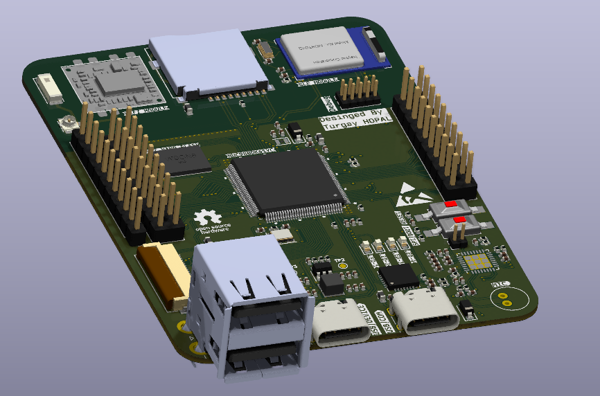
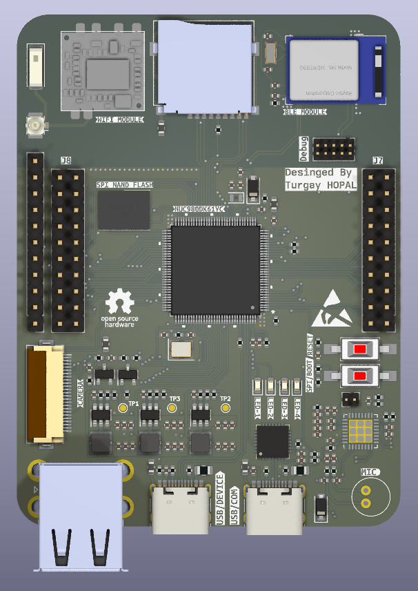
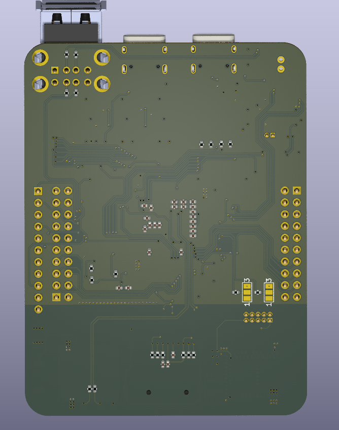
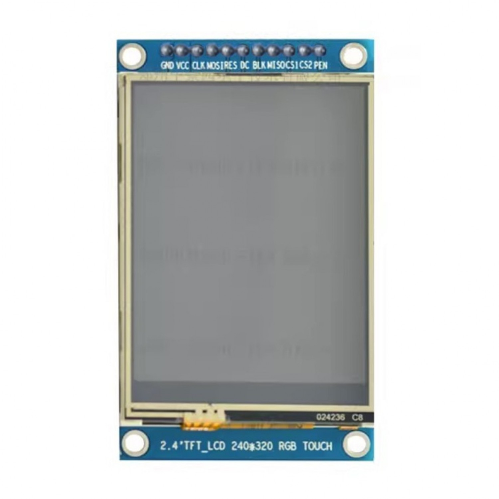
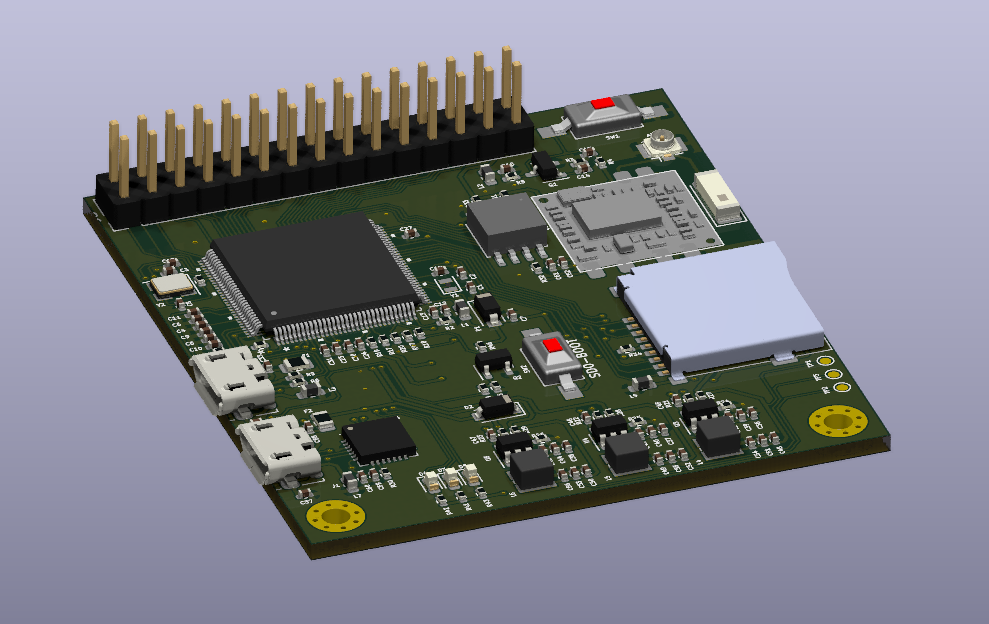
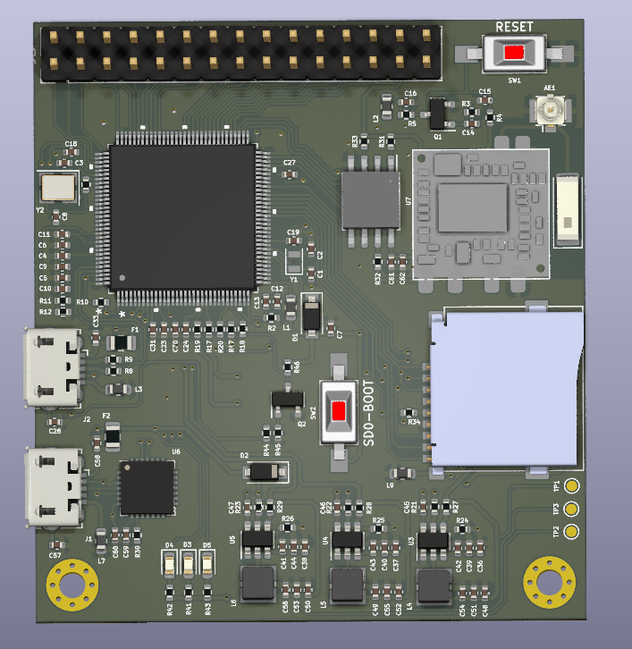
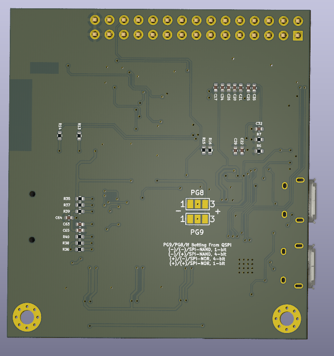

# Linux-Core Development Board

- This project goal is developing myself about embedded linux environment like buildroot, the yacto project.

### Linux Core v2 Features

- NUC980 Series Microprocessor
- 2A Step-Down Voltage Regulator 1.2V, 1.8V, 3.3V
- RLT8188EU WIFI USB Module
- CP2102 USB TTL
- ILI9143 TFT LCD Header
- NAU88C22YG Audio Speaker
- Cam Slot
- SPI Nand External Flash
- MDBT5DQ (NRF52840 Bluetooth Bodule with USB) (Experimental !!!)
- 2 USB Host Socket
- 2 - 2x10 User Pin Header
- SD Card Slot
- 4 User LED's

### PCB Features

- 60.1mm x 80.1mm
- 1mm board thickness.
- 4 layer PCB.
- 0.45 / 0.3 vias

### Linux Core v1 Features

- NUC980 Series Microprocessor
- 2A Step-Down Voltage Regulator 1.2V, 1.8V, 3.3V
- RLT8188EU WIFI USB Module
- CP2102 USB TTL
- 128 KB External SPI-NOR Flash
- SD Card Slot
- 3 User LED's

### PCB Features

- 52.6mm x 57.5mm
- 1.6mm board thickness.
- 2 layer PCB.
- 0.6 / 0.3 vias

## Linux Core v2 Images

### Right Side

### Front Side

### Back Side

### LCD

## Linux Core v1 Images

### Right Side

### Front Side

### Back Side

